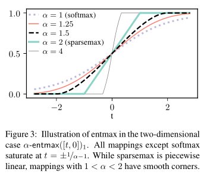

# entmax


--------------------------------------------------------------------------------

This package presents a pytorch implementation of entmax and entmax losses:
an sparse family of probability mappings and corresponding loss functions,
generalizing softmax / cross-entropy.

*Features:*
  - Exact partial-sort algorithms for 1.5-entmax and 2-entmax (sparsemax).
  - A bisection-based algorithm for generic alpha-entmax.

*Requirements:* python 3, pytorch >= 1.0 (and pytest for unit tests)

## Example

```python
In [1]: from torch.nn.functional import softmax

In [2]: from entmax.activations import sparsemax, entmax15

In [3]: import torch

In [4]: x = torch.tensor([-2, 0, 0.5])

In [5]: softmax(x, dim=0)
Out[5]: tensor([0.0486, 0.3592, 0.5922])

In [6]: sparsemax(x, dim=0)
Out[6]: tensor([0.0000, 0.2500, 0.7500])

In [7]: entmax15(x, dim=0)
Out[7]: tensor([0.0000, 0.3260, 0.6740])
```

## Citation

[Sparse Sequence-to-Sequence Models](https://www.aclweb.org/anthology/P19-1146)

```
@inproceedings{entmax,
  author    = {Peters, Ben and Niculae, Vlad and Martins, Andr{\'e} FT},
  title     = {Sparse Sequence-to-Sequence Models},
  booktitle = {Proc. ACL},
  year      = {2019},
  url       = {https://www.aclweb.org/anthology/P19-1146}
}
```

Further reading:

  - Blondel, Martins, and Niculae, 2019. [Learning with Fenchel-Young Losses](https://arxiv.org/abs/1901.02324).
  - Martins and Astudillo, 2016. [From Softmax to Sparsemax: A Sparse Model of Attention and Multi-Label Classification](https://arxiv.org/abs/1602.02068).

